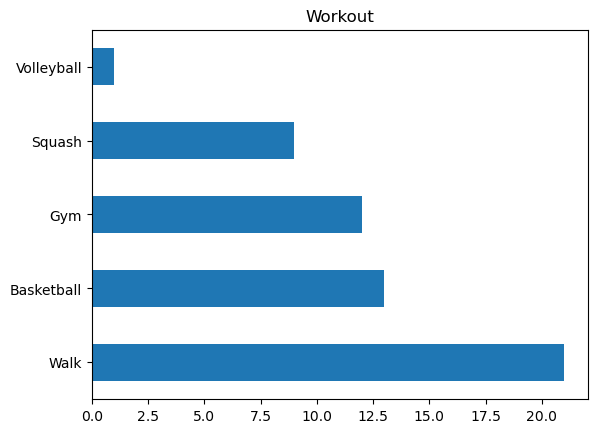
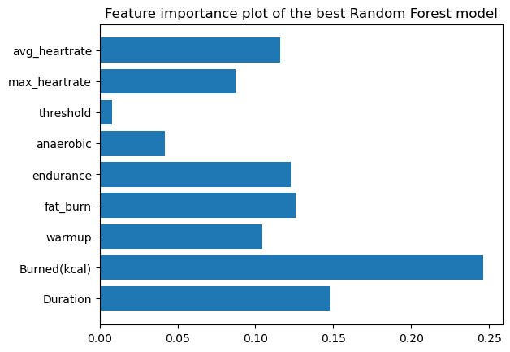

# Workout Classifier

## Introduction

This project is an ML pipeline that uses various models to classify workouts. The notebooks go through my personal workout data to find patterns and then classify them. The data has been retrieved from my smart watch.

## Data

The various sections that are included in the data are:

- Workout (str) : What type of workout was recorded.
- Duration (int): Time in minutes that the workout was done over.
- Burned(kcal) (int): Number of calories that were burnt during the workout.
- Warmup (int): Time in minutes that was spent during warmup.
- Fat_burn (int): Time in minutes that was spent during fat burning.
- Endurance (int): Time in minutes that was spent during endurance.
- Anareboic (int): Time in minutes that was spent during anaerobic respiration.
- Threshold (Boolean): 1 if heart rate crossed 190 beats per minute during the workout, 0 otherwise.
- Max_heartrate (int): The maximum heart rate reached during the workout.
- Avg_heartrate (int): The average heart rate during the workout.

Warmup, fat burn, endurance, and anaerobic are the four categories that the workout is distributed into based on my heart rate and burning of calories. How exactly this distribution works is not available in public data that could be found on Oneplus's official website.

The workouts are distributed as follows:

## Models

The models that are used in this project are:

- Random Forest
- K-Nearest Neighbors
- Support Vector Machine
- XGBoost
- Convolutional Neural Network (CNN)
- Autoencoders
- Recurrent Neural Networks with LSTM
- Gradient Boosting with Stochastic Gradient Bossting Machines (SGBM)
- Ensemble methods with stacking
- Convolutional Recurrent Neural Networks (CRNN)
- Naive Bayes Classifier

## Further Work

The data was limited so it was boosted with the use of Variational Autoencoders and then the models were run again.

## Results

The Random Forest model performed the best at predicting the workouts. The feature importance table is as follows:

## Data Ethics

Throughout this pipeline, the data that was used doesn't carry any kind of labels that could connect it to a specific person. Moreover, the purpose of the model was primarily for social good and not targeting any individual or group of people. No malicious practices were followed and all the metrics reported were with honesty making sure that the confidence in model performance was not over-estimated. The data processing and training is explicit, can be repicated on the data and was used in a manner that allowed for easy following along for a reader.  
Finally, the data has been taken from my personal smart watch and thus does not contain any risks in terms of privacy of other individuals. Along with that, it also doesn't include sensitive information such as location or exact time of workout which could be used to identify a person.
